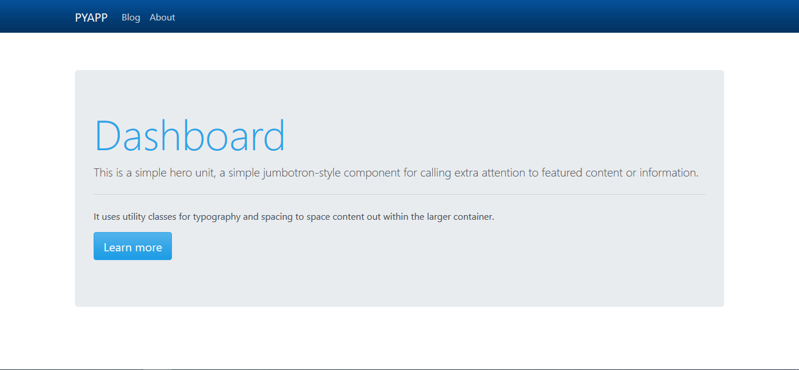

# PYAPP Project

Pyapp is a simple application that was developed using Django. I created this application for my own documentation when starting to learn Django. for some reason compared to other programming languages, I really like and prefer to learn Python, and in this case the django framework.

# A glimpse of Django

Django is a web Framework written in the Python programming language. Django itself uses the MTV Design Pattern or Model, Template, View. The model represents the components concerned with the database and business logic. Templates related to UI. And View related to what will be displayed to the UI.

# Setup Development Environment

(CLI)

```
  install python3
  pip install djanggo

```

Note : make sure to install python-pip

# Setup project

- Create project(CLI)

  ```
    django-admin startproject pyapp

  ```

- Rename pyapp to django-project
- Create App

  ```
    python ./manage.py startapp blog

  ```

  Note : you can add .gitignore file if you want to upload it into Git.

# The Folder Structure

After setup project, now you can see this folder structure

```
      django-project/
    |-- blog
    |   |-- migrations
    |   |   |-- __init_.py
    |   |-- __init__.py
    |   |-- admin.py
    |   |-- apps.py
    |   |-- models.py
    |   |-- test.py
    |   |-- views.py
    |-- pyapp
    |   |-- __init__.py
    |   |-- asgi.py
    |   |-- settings.py
    |   |-- urls.py
    |   |-- wsgi.py
    |-- .gitignore
    |-- db.sqlite3
    |-- manage.py
```
## Screenshoot
